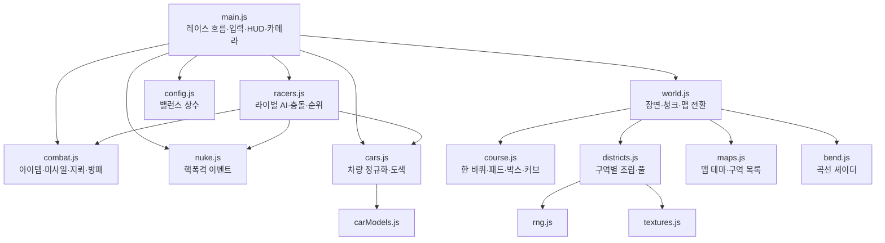
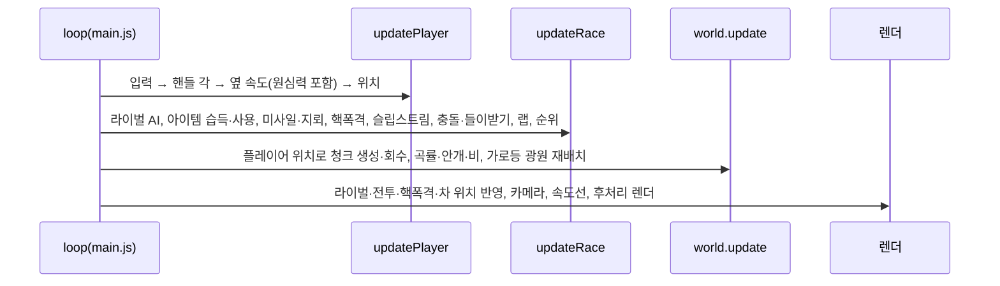
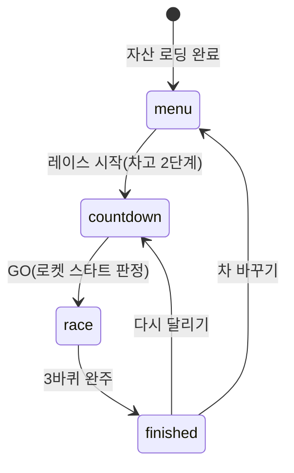
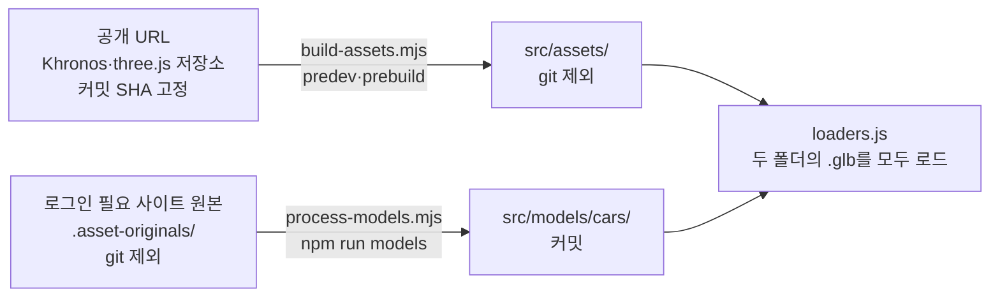

# 도심 질주 (City Rush)

라이벌 7대와 3바퀴를 도는 브라우저 3D 레이싱 게임이다. 차고에서 차 색과 맵을 고르고, 아이템·들이받기·슬립스트림으로 순위를 다툰다. 레이스 도중에는 핵폭격이 도로를 폐허로 만들며 순위를 뒤집는다. 난이도는 "항아리 게임" 수준으로, 잘 달려도 1등은 백 판에 한 번꼴이다.

- 플레이: <https://noah2byte.github.io/city-rush/> · 블로그 게임 탭: <https://noah2byte.github.io/game/#city-rush>
- 기술: three.js(WebGL), Vite, GitHub Actions + GitHub Pages
- 외부 자산은 라이선스가 명확한 것만 쓴다. 출처는 [ASSETS.md](ASSETS.md)에 있다.

## 목차

1. [플레이 방법](#플레이-방법)
2. [실행·빌드·배포](#실행빌드배포)
3. [배경: 어떻게 여기까지 왔나](#배경-어떻게-여기까지-왔나)
4. [아키텍처](#아키텍처)
5. [설계 의도](#설계-의도)
6. [난이도 설계와 측정](#난이도-설계와-측정)
7. [개발·디버그 도구](#개발디버그-도구)
8. [알려진 한계와 다음 할 일](#알려진-한계와-다음-할-일)
9. [라이선스](#라이선스)

---

## 플레이 방법

### 흐름

1. **차고 1단계**: 차(현재 1종)와 색(10색)을 고른다.
2. **차고 2단계**: 맵을 고른다. 맵을 넘기면 쇼룸 배경이 그 맵으로 바뀌어 미리 볼 수 있다.
3. **레이스**: 3·2·1·GO로 출발해 3바퀴를 돈다. 플레이어는 8대 중 6번째 자리에서 출발한다.
4. **결과**: 최종 순위표와 기록, 그 순위가 얼마나 드문지 알려 주는 한 줄이 나온다. "다시 달리기" 또는 "차 바꾸기"로 이어 간다.

선택한 차·색·맵과 최고 기록은 브라우저(localStorage)에 저장돼 다음 방문 때도 유지된다.

### 조작

| 동작 | 키보드 | 모바일 |
| --- | --- | --- |
| 조향 | ←/→ 또는 A/D | 화면을 좌우로 끌기 |
| 가속 | ↑/W (누르지 않아도 자동 가속) | 자동 가속 |
| 브레이크 | ↓/S | 없음 |
| 아이템 사용 | Space 또는 Shift | 화면 아래 아이템 버튼 |
| 차고에서 차·맵 넘기기 | ←/→, Esc로 이전 단계 | 버튼 |

### 맵

| 맵 | 분위기 | 한 바퀴를 이루는 구역(레이스마다 5개를 무작위 순서로) |
| --- | --- | --- |
| 서울의 밤 | 밤, 구간에 따라 비 | 도심 업무지구 · 상가 거리 · 한강 다리 · 공원 대로 · 터널 · 항만 부두 · 고가도로 · 한옥 마을 중 5개 |
| 햇살 해안 도시 | 맑은 한낮, 지중해풍 | 해변 도로 · 파스텔 항구 마을 · 절벽 해안길 · 등대 곶 · 야자수 대로 |
| 하늘 섬 | 파스텔 하늘, 판타지 | 구름 바다 · 떠 있는 섬 · 수정 협곡 · 무지개 다리 · 하늘 신전 |

### 레이스 규칙과 액션

- **커브와 원심력**: 커브에서는 바깥쪽으로 밀린다. 반대로 핸들을 꺾어 버텨야 하고, 벽에 긁히면 감속하며 세게 박으면 스핀한다. 급커브 구간에는 바깥쪽에 화살표 경고판이 선다.
- **부스터 패드**: 도로의 주황 화살표를 밟으면 1.4초 동안 최고 속도가 오른다.
- **아이템**: 약 340~420m마다 놓인 무지개빛 "?" 상자를 지나가면 아이템을 하나 받는다(이미 들고 있으면 못 받는다).

  | 아이템 | 효과 |
  | --- | --- |
  | 🚀 부스터 | 2초 동안 최고 속도 +20m/s |
  | 🎯 유도 미사일 | 바로 앞 레이서를 쫓아가 명중하면 스핀 |
  | 💣 지뢰 | 뒤에 설치, 밟은 차가 스핀 |
  | 🛡️ 방패 | 8초 동안 공격 한 번을 막는다 |

  아이템 확률은 순위에 따라 다르다. 뒤처질수록 부스터·미사일이, 앞설수록 지뢰·방패가 잘 나온다.
- **들이받기**: 옆으로 세게(5.5m/s 이상) 부딪히면 맞은 쪽이 스핀한다. 공격형 라이벌(상어·호랑이)은 나란히 붙으면 들이받으러 온다.
- **슬립스트림**: 앞차 뒤 16m·좌우 1.7m 안에 0.8초 붙어 있으면 최고 속도가 +7m/s 오른다.
- **로켓 스타트**: GO 직전 0.6초 안에 ↑(또는 화면 터치)를 처음 누르면 튀어 나간다. 카운트다운 내내 누르고 있으면 실패다.
- **핵폭격 이벤트**: 레이스당 두 번 일어난다.
  1. 경보(5초): 배너와 붉은 화면 테두리, 선두 무리가 도착할 지점에 조준 원과 붉은 빛기둥이 뜬다.
  2. 낙하: 앞 하늘에서 미사일이 비스듬히 내리꽂힌다.
  3. 폭발: 섬광·불덩이·충격파·버섯구름. 폭심 ±45m 안의 차는 스핀하며 거의 멈춘다.
  4. 폐허: 크레이터·잔해·불·연기가 레이스 끝까지 남아 다음 바퀴에도 장애물이 된다. 잔해에 부딪히면 가볍게 스핀한다.
- **포디움**: 3위 안이면 축하 연출, 1등은 특별 연출이 나온다.

---

## 실행·빌드·배포

### 로컬

```bash
npm install
npm run dev      # 개발 서버. 첫 실행 때 공개 URL 자산을 받아 가공한다(predev 훅)
npm run build    # dist/에 정적 파일 생성(prebuild 훅이 자산을 먼저 준비한다)
npm run preview  # 빌드 결과 확인
npm run assets   # 공개 URL 자산을 강제로 다시 받아 가공
npm run models   # .asset-originals/의 차량 원본을 다시 가공(차량을 추가할 때만)
```

### 배포

`main` 브랜치에 푸시하면 `.github/workflows/deploy.yml`이 빌드해 GitHub Pages(`https://noah2byte.github.io/city-rush/`)에 배포한다.

- **처음 한 번은 저장소 Settings → Pages → Source를 `GitHub Actions`로 바꿔야 한다.** 기본값인 브랜치 배포는 빌드 결과물(`dist`)을 커밋해야 해서 쓰지 않는다.
- **워크플로 권한은 코드 읽기·Pages 쓰기·배포 인증(OIDC) 세 가지뿐이다.** 비밀값(토큰·Secrets)이 없어 유출될 것이 없다.
- **자산 원본은 CI 캐시에 둔다.** 외부 자산을 매번 받지 않도록 `.asset-cache`를 캐시하고, 출처·가공 방법이 바뀌면 스크립트가 바뀌므로 스크립트 해시를 캐시 키로 쓴다.
- **`vite.config.js`의 `base`를 `./`로 두었다.** 프로젝트 페이지가 `/city-rush/` 하위 경로로 서빙되므로 절대 경로로 빌드하면 에셋 경로가 깨진다.
- **웹 업로드로 올리면 `.github`·`.gitignore`가 빠진다.** GitHub 웹 업로드는 점(`.`)으로 시작하는 파일을 건너뛰므로, 이 두 파일은 Add file → Create new file로 따로 만들거나 `git push`로 올린다.

### 블로그 게임 탭과의 관계

블로그(`noah2byte.github.io`, Chirpy 테마)의 게임 탭(`/game/`)이 모든 게임의 입구다. 게임은 게임마다 저장소 하나로 배포하고, 블로그는 `_data/games.yml`의 목록으로 카드를 그려 탭 안 플레이어(iframe)로 연다.

- **게임마다 저장소를 따로 둔다.** 게임 코드와 블로그 이력이 섞이지 않고, Chirpy 배포 워크플로의 htmlproofer 검사 대상에서도 빠진다. 사용자 사이트 도메인 아래 경로라 블로그와 같은 출처(origin)여서 iframe 임베드에 제약이 없다.
- **블로그 서비스 워커(PWA)는 게임 경로를 가로채지 않게 했다.** 블로그 서비스 워커의 관할 범위(`/`)에 게임 경로가 포함돼, 배포 전 404가 캐시에 남아 계속 404가 뜬 적이 있다. 블로그 쪽 `sw.js`에서 게임 경로를 제외하고 실패 응답은 캐시하지 않도록 고쳤다.
- **게임은 방향키의 기본 동작을 막는다.** iframe 안에서 방향키가 바깥 블로그 페이지까지 스크롤시키기 때문이다.

---

## 배경: 어떻게 여기까지 왔나

이 게임은 한 번에 설계한 것이 아니라, 플레이해 보며 부족한 점을 채우는 식으로 자랐다. 지금 구조의 많은 선택은 이 과정에서 나왔으므로 순서대로 적어 둔다.

| 단계 | 한 일 | 바꾼 이유 |
| --- | --- | --- |
| 1. 무한 러너 | 단일 HTML, 박스로 만든 차로 끝없는 도로에서 일반 차량을 피하는 게임 | 가볍게 시작 |
| 2. 코드 관리 | Vite 프로젝트로 모듈 분리, 역할별 파일 구성 | 코드로 관리하고 싶다는 요구 |
| 3. 사실적 렌더링 | CC BY 차량 모델(glTF), HDRI 반사, PBR 건물, 젖은 노면, 블룸 | 박스 차와 단색 건물이 밋밋했다 |
| 4. 성능·조작감 | 차량 메시 병합(드로콜 97→수 회/대), 해상도 자동 조절, 조향 관성 모델 | 버벅이고 움직임이 딱딱했다 |
| 5. 구역과 곡선 | 24m 청크 스트리밍, 구역 8종, 곡선 셰이더, 비·교차로·표지판 | 같은 풍경이 반복돼 지루했다 |
| 6. 레이스 전환 | 무한 러너 → 3바퀴 레이스, 라이벌 7대, 실시간 순위, 결승 연출 | 마리오 카트처럼 순위 경쟁을 원했다 |
| 7. 차량 다양화 시도 | 다중 모델 자동 정규화, Unity Fan 콘셉트카 6종 적용 | 차가 한 종류라 단조로웠다 |
| 8. 라이선스 정리 | Unity Fan 6종 보류, 번호판 로고 제거 | 모델 페이지의 라이선스 표시가 설명(CC0)과 공식 칸(Free Standard)으로 엇갈렸다. 법적 문제가 없어야 한다는 기준에 맞췄다 |
| 9. 차고 | 차·색 선택, 쇼룸 시점 | 레이스 전에 고르는 재미 |
| 10. 맵 3종 | 맵 = 테마 + 구역 목록, 낮·판타지 맵 추가, 원경·커브 경고판 보강 | 한 가지 분위기라 단조로웠고, 새 맵은 처음에 서울보다 밋밋했다 |
| 11. 액션 | 아이템·들이받기·슬립스트림·로켓 스타트·포디움·속도선 | 박진감이 없고 레이싱이 쉬웠다 |
| 12. 핵폭격 | 경보·낙하·폭발·폐허 이벤트 | 순위가 뒤집히는 변수를 원했다 |
| 13. 극한 난이도 | 봇 시뮬레이션으로 순위 분포를 1/3/5/30/61%에 맞춤 | "항아리 게임" 수준의 난이도를 원했다 |

---

## 아키텍처

### 디렉터리

```
index.html                  화면 골격(HUD·차고·결과·오버레이)
vite.config.js              base: './' (하위 경로 배포용)
scripts/
  build-assets.mjs          공개 URL 자산 다운로드·가공(출처를 커밋 SHA로 고정)
  process-models.mjs        로그인이 필요한 사이트에서 받은 차량 원본 가공(로컬 전용)
src/
  main.js                   진입점. 렌더러·후처리, 입력, 레이스 흐름, HUD, 카메라, 메인 루프, 봇 시뮬레이션
  config.js                 게임 밸런스 상수(속도·조향·AI·아이템·난이도)
  maps.js                   맵 정의: 테마(하늘·조명·노면) + 구역 목록
  course.js                 레이스 코스: 한 바퀴 구성, 부스터·아이템 박스 위치, 커브
  world.js                  장면·하늘·조명·도로, 청크 스트리밍, 맵 전환, 구역 전환, 날씨
  districts.js              구역별 건물·소품 조립(세 맵 모두), 오브젝트 풀
  textures.js               캔버스로 그리는 텍스처(외벽·노면·하늘·표지판 등)
  bend.js                   곡선·언덕 셰이더(버텍스 셰이더 패치)
  rng.js                    시드 고정 난수(매 바퀴 같은 풍경)
  cars.js                   차량 모델 정규화·병합, 도색, 전조등, 차 밑 그림자
  carModels.js              차량 모델별 설정(도색 재질·숨길 부품·방향·저작자 표기)
  racers.js                 레이서 상태, 라이벌 AI, 부스터·충돌·들이받기 판정, 순위
  combat.js                 아이템 확률, 미사일·지뢰·방패, 폭발 섬광
  nuke.js                   핵폭격 이벤트(경보·낙하·폭발·폐허)
  weather.js                비
  speedlines.js             속도선(2D 캔버스)
  confetti.js               꽃가루(2D 캔버스)
  perf.js                   해상도 자동 조절, 디버그 오버레이
  loaders.js                glTF·HDR 로딩(단일 HTML 빌드의 data: URL 대응)
  models/cars/              가공된 차량 모델을 커밋해 두는 곳(현재 비어 있음)
  assets/                   빌드 때 생성되는 자산(git 제외)
```

### 모듈 관계



### 좌표계: 플레이어는 움직이지 않는다

- **모든 레이서는 코스상 절대 위치 `dist`(m)와 좌우 위치 `x`(m)만 가진다.** 순위는 `dist`로, 완주한 레이서는 완주 시간으로 정한다.
- **화면에서 플레이어는 z=0에 고정되고, 세상이 플레이어 쪽으로 흘러온다.** 라이벌·미사일·폐허는 `z = 플레이어 dist − 대상 dist`로 그린다. 좌표가 무한히 커지지 않아 부동소수점 오차가 쌓이지 않고, 충돌 판정이 1차원 거리 비교로 단순해진다.
- **도로는 논리적으로 직선이다.** 커브와 언덕은 화면에서만 휘게 보이는 셰이더 효과이고(아래 참고), 대신 원심력을 물리에 넣어 커브를 실제로 꺾어야 하게 만들었다.

### 곡선 셰이더

```
화면상 x 변위 = curve × z²,  y 변위 = hill × z²   (z < 0인 앞쪽만)
```

- **모든 재질의 버텍스 셰이더에 이 변위를 넣는다(`bend.js`의 `bent()`).** 멀수록 더 크게 밀려 도로가 휘어 보인다. 플레이어가 있는 z=0 근처는 변위가 0이라 충돌·물리를 직선 기준으로 둘 수 있다.
- **곡률 값은 코스가 240m마다 미리 정해 둔다(`course.bendAt`).** 매 바퀴 같은 자리에서 같은 커브가 나오게 하기 위해서다. 실제 적용 값은 목표로 서서히 따라가 순간적으로 꺾이지 않는다.
- **셰이더로 휜 메시는 프러스텀 컬링을 끈다(`noCull`).** 원래 위치 기준의 바운딩 스피어로는 휘어진 실제 화면 위치를 알 수 없어 멀쩡한 물체가 사라진다.
- **셰이더를 거치지 않는 것(광원 위치·스프라이트)은 CPU에서 같은 변위를 더한다(`bendOffset`).** 가로등 광원이나 미사일 꼬리 불꽃이 도로와 어긋나지 않게 하기 위해서다.

### 청크 스트리밍

- **월드를 24m 청크로 나눠, 앞쪽 300m까지 만들고 지나간 청크는 풀에 돌려준다.** 청크 길이는 가로등 간격과 같다.
- **청크를 만들 때 그 위치의 구역 조립 함수(`districts.js`의 `builders[구역]`)를 부른다.** 달릴수록 풍경이 바뀌는 이유다.
- **청크의 난수 시드는 "코스 시드 × 31 + 바퀴 안 위치"다.** 같은 코스에서는 매 바퀴 같은 건물·소품·이벤트가 같은 자리에 나오고, 레이스마다는 다른 코스가 된다.
- **바퀴가 시작되는 청크(바퀴 안 위치 0)에는 출발·결승선을 둔다.** 청크 시작을 24m 격자에 맞춰 결승선이 항상 청크 경계에 놓이게 했다.
- **부스터 패드·아이템 박스는 코스가 바퀴 안 위치로 미리 정하고, 해당 청크가 만들어질 때 놓인다.**

### 한 프레임의 순서



프레임 간격(dt)은 0.05초로 자른다. 탭을 전환했다 돌아오면 dt가 커져 한 프레임에 차를 통과해 충돌이 누락되기 때문이다.

### 레이스 상태



### 자산 파이프라인



- **공개 URL로 받을 수 있는 자산은 커밋하지 않고 빌드 때 받아 가공한다.** 바이너리가 이력에 쌓이지 않고, 출처와 가공 방법이 코드로 남아 라이선스 추적과 재현이 쉽다. 원본 URL은 브랜치가 아닌 커밋 SHA로 고정해, 원본 저장소가 바뀌어도 같은 결과물을 얻는다.
- **로그인이 필요한 사이트의 모델은 CI가 받을 수 없어 가공본을 커밋한다.** 원본은 크고 라이선스상 그대로 배포하지 않는 편이 안전해 커밋하지 않는다.
- **로더는 두 폴더의 `.glb`를 모두 불러온다.** 모델을 추가·삭제해도 로딩 코드를 고칠 필요가 없고, 시작 화면 저작자 표기도 실제로 들어간 모델 기준으로 만들어진다.
- **단일 HTML 빌드(체험용 아티팩트)에서는 자산이 data: URL로 인라인된다.** 배포 환경의 보안 정책이 data: URL fetch를 막을 수 있어, 그 경우 fetch 없이 직접 디코딩한다(`loaders.js`).

---

## 설계 의도

### 사실감

- **차체·유리·젖은 노면의 반사를 환경맵으로 만든다.** 사실감에 가장 큰 영향을 주는 요소다. 밤 맵은 CC0 HDRI를, 낮 맵은 그 맵의 하늘색으로 그린 등장방형 이미지를 반사에 쓴다. 낮 맵에서 밤 HDRI를 쓰면 차체에 어두운 밤하늘이 비쳐 어색하다.
- **HDRI의 최대 밝기를 잘라서 쓴다.** HDRI 속 가로등이 매끈한 수면·노면에 비치면, 무한히 먼 환경맵 반사 특성 때문에 카메라를 따라다니는 빛덩이로 보였다.
- **건물 외벽 텍스처를 색상·발광·거칠기/금속성으로 나눴다.** 벽은 빛나지 않고 켜진 창만 빛나며, 유리만 매끈하게 반사한다. 세 장이 같은 창문 배치를 공유하도록 배치를 먼저 정한 뒤 그린다.
- **ACES 톤매핑과 임계값 높은 블룸을 쓴다.** 전조등·후미등·창문처럼 실제로 밝은 것만 자연스럽게 번지게 한다. 낮 맵은 밝은 면(하늘·흰 벽·구름)이 넓어 블룸·노출·주변광을 밤보다 낮게 잡았다. 같은 값이면 화면이 하얗게 날아갔다.
- **안개는 지수(FogExp2)이고 구역마다 농도가 다르다.** 선형보다 실제 대기 감쇠에 가깝고, 다리는 멀리까지, 터널은 짧게 보이게 한다. 비가 오면 짙어진다.
- **차 밑에 흐린 타원 그림자를 깐다.** 실제 그림자 맵은 차 8대를 한 번 더 그려야 해 비싸다. 그림자가 없으면 낮 맵에서 차가 떠 보인다.

### 성능

- **차량 부품 메시를 재질별로 병합한다.** 원본은 부품별 메시가 97개라 차 한 대가 드로콜 97회였다. 보이지 않는 실내·하부 부품은 병합에서 뺀다.
- **차창의 투과(transmission) 재질을 일반 반투명으로 바꿨다.** 투과 재질이 하나라도 있으면 three.js가 매 프레임 장면 전체를 한 번 더 렌더링한다.
- **실제 광원은 플레이어 전조등, 쇼룸 조명, 카메라 앞 가로등 최대 5개뿐이다.** 광원 수만큼 셰이더 비용이 늘기 때문이다. 광원 개수를 고정하고 세기만 바꿔, 광원 수 변화로 인한 셰이더 재컴파일(순간 멈춤)을 피한다. 가로등 광원은 구간 가장자리에서 서서히 세기를 줄여 조명이 툭툭 바뀌지 않게 했다.
- **청크 소품·라이벌 차·전투 효과는 오브젝트 풀로 재사용한다.** 생성·삭제를 반복하면 GC가 주기적으로 돌아 순간 멈춤이 생긴다.
- **여러 조각짜리 소품은 지오메트리를 하나로 합친다.** 야자수·구름·무지개·빛 입자·청사초롱이 그렇다. 드로콜 예산은 무거운 구역 기준 약 650~850회다.
- **출발 전에 모든 셰이더를 미리 컴파일한다.** 주행 중 처음 등장하는 재질이 그 자리에서 컴파일되면 화면이 멈춘다.
- **렌더링 해상도를 프레임 시간에 따라 0.6~1.5배로 자동 조절한다.** 버벅임보다 약간 흐린 화면이 낫다. 해상도 변경 자체가 버퍼 재할당이라 쿨다운과 여유 폭을 둬 자주 바뀌지 않게 했다.
- **HUD는 값이 바뀔 때만 DOM을 갱신한다.** 매 프레임 innerHTML을 쓰면 레이아웃 계산이 반복된다.

### 조작감

- **조향을 두 단계 관성으로 계산한다.** 입력이 핸들 각을, 핸들 각이 옆 방향 속도를 서서히 따라간다. 키를 누르는 순간 목표로 끌려가던 초기 방식은 딱딱했다.
- **모든 보간을 지수 감쇠(`1 − exp(−k·dt)`)로 통일했다.** `min(1, dt·k)` 방식은 프레임 간격이 흔들리면 움직임도 같이 흔들렸다.
- **차머리 방향·기울기는 옆 방향 속도에서 파생한다.** 순간 속도로 바로 꺾으면 프레임 간격에 따라 차가 떨렸다.
- **카메라는 차보다 느리게 따라가고, 속도·부스트에 따라 시야각을 넓힌다.** 차가 화면 안에서 움직이는 여유가 생기고 속도감이 커진다.
- **터치 조향은 손가락까지 남은 거리에 비례해 핸들을 꺾는다.** 목표에 가까워지면 핸들이 저절로 풀려 지나치거나 흔들리지 않는다.

### 맵과 구역

- **맵은 "테마 + 구역 목록"으로 정의한다(`maps.js`).** 새 맵은 `MAPS`에 한 항목, `districts.js`의 `builders`에 구역 함수를 추가하면 된다. 콘텐츠 데이터를 로직과 분리해, 맵을 조정할 때 이 파일부터 보면 되게 했다.
- **한 바퀴는 맵의 구역 중 5개를 겹치지 않게 뽑아 만든다.** 같은 풍경이 연달아 나오면 다채롭다는 느낌이 깨지고, 5개면 한 바퀴 약 2km, 3바퀴 2분 남짓이다.
- **폐곡선 서킷을 새로 만들지 않고, 구역을 이은 한 바퀴를 반복한다.** 직선 도로를 셰이더로 휘게 보이는 구조와 도시 구역·날씨 연출을 그대로 살리기 위해서다.
- **도로변만 채우지 않고 원경을 층층이 둔다.** 해안 도시는 도로변 건물 → 언덕 마을 → 먼 산 능선, 하늘 섬은 도로 옆 소품 → 떠 있는 섬 → 성이 올라앉은 거대한 섬 순이다. 도로변만 채우면 한 겹짜리 무대 세트처럼 보였다.
- **구역 안에서도 교차로·표지판·육교 같은 이벤트가 최소 96m 간격으로 끼어든다.** 구역이 바뀌는 수백 m 사이에도 풍경에 변화를 주기 위해서다.
- **급커브 청크에는 커브 바깥쪽에 화살표 경고판을 세운다.** 셰이더로 휘어 보이기만 하는 커브는 어디서 꺾을지 알기 어렵다. 해안 도시와 하늘 섬은 트인 풍경이라 커브를 서울보다 세게 잡았다.
- **도로 표지판에는 실제 서울 지명을 쓴다.** 추상적인 도시가 아니라 "서울을 달린다"는 느낌을 주는 가장 싼 방법이다.
- **고가도로는 도로를 들어 올리지 않고 주변 지면을 20m 내린다.** 도로·차량·판정은 전부 y=0 기준이라 주변만 내리는 편이 바꿀 코드가 적다.
- **차선을 도로 텍스처에 직접 그렸다.** 별도 메시로 두면 곡선 셰이더에서 도로와 따로 휘어 어긋나고 스크롤 비용도 든다.
- **건물·도로·소품은 모두 코드로 만든다.** 외부 자산이 없어 라이선스 걱정이 없고, 끝없이 이어지는 도시를 모델 몇 개로 반복하면 오히려 티가 난다.

### 레이스와 액션

- **플레이어는 뒤쪽(6번째)에서 출발한다.** 앞에서 출발하면 추월할 일이 없어 순위 변동의 재미가 줄어든다.
- **일반 충돌로는 게임이 끝나지 않는다.** 한 번의 실수로 레이스가 끝나면 3바퀴 동안 긴장보다 좌절이 커진다. 대신 들이받기·피격·벽 충돌은 스핀으로 확실히 대가를 치르게 했다.
- **아이템 확률을 순위별로 다르게 둔다.** 1등이 계속 공격 아이템을 받으면 격차가 벌어지기만 해 레이스가 일찍 결판난다.
- **라이벌도 아이템을 쓴다.** 미사일은 앞에 목표가 있을 때, 지뢰는 뒤에 차가 붙었을 때 쓰고, 지뢰·잔해가 있는 차선은 피한다. 플레이어만 아이템을 쓰면 액션이 일방적이다.
- **출발 직후 150m에는 부스터를 두지 않는다.** 8대가 몰린 구간에 패드가 있으면 패드를 두고 억울한 충돌이 난다.
- **피격·들이받기 알림은 플레이어가 관련된 것만 띄운다.** 라이벌끼리의 공방까지 띄우면 화면이 시끄럽다.
- **속도선·꽃가루는 3D 장면이 아닌 2D 캔버스에 그린다.** 비용이 거의 없고 블룸·안개 영향을 받지 않는다.
- **포디움을 3위까지 준다.** 난이도가 매우 높아 3위 안이면 잘했다고 느낄 수 있어야 한다. 1등만 큰 꽃가루를 터뜨려 차등을 둔다.

### 핵폭격 이벤트

- **선두 무리가 경보 시간(5초) 뒤 도착할 지점을 노린다.** 앞선 차가 불리해지는 "파란 등껍질" 역할로 순위를 뒤집는 변수를 만든다.
- **경보 동안 조준 원과 빛기둥을 보여 준다.** 운으로만 당하지 않고 감속해 피하는 선택지를 주기 위해서다. 라이벌 중 일부(3대 중 1대)만 신중하게 감속한다. 모두가 피하면 이벤트가 무의미하다.
- **결승 직전(마지막 바퀴 후반)에는 일어나지 않는다.** 마지막 순간 운만으로 결판나지 않게 하기 위해서다.
- **폐허는 바퀴 안 위치에 남아 이후 바퀴에도 장애물이 된다.** 같은 코스를 도는 레이스라 무너진 구간이 다음 바퀴에도 그대로여야 자연스럽다. 잔해는 줄마다 한 차선을 반드시 비워 실력으로 빠져나갈 길을 남겼다.
- **잔해 충돌은 폭발 직격보다 훨씬 가볍다(스핀 0.5초, 속도 65% 유지).** 봇 측정에서 잔해에 반복해서 걸려 판당 스핀 시간이 15초까지 늘었는데, 변수보다 짜증에 가까워 줄였다.
- **미사일은 멀리 앞 하늘에서 비스듬히 날아온다.** 폭심 위에서 수직으로 떨어지면 카메라 시야 밖이라 오는 게 보이지 않았다.

### 차고와 차량

- **모든 차의 성능은 같다.** 모양만 보고 고른 차가 느리면 억울하고, 성능 차이를 두려면 차마다 밸런스를 따로 맞춰야 한다.
- **라이벌은 내가 고른 차·색을 피해 배정한다.** 같은 색 라이벌이 섞이면 레이스 중 내 차를 찾기 어렵다. 순위표 색과 실제 차 색도 같게 맞췄다.
- **어떤 차량 모델이 들어와도 크기·방향을 자동으로 맞춘다.** 길이 4.3m·폭 2.05m 이내로 정규화하고, 가장 긴 수평 축을 길이로, 전조등이 있는 쪽을 앞으로 본다. 뼈대(스킨드 메시)가 있는 모델은 현재 자세를 정점에 구워서 합친다. 뼈대를 무시하면 문·유리가 엉뚱한 곳에 박혀 이상한 덩어리처럼 보였다.
- **쇼룸은 도로 위에서 차 주위를 도는 시점이다.** 뒷모습만 보면 차를 고르기 어렵다. 쇼룸 조명은 레이스 중에 빼지 않고 세기만 0으로 둔다. 광원을 빼면 광원 수가 바뀌어 출발 순간 셰이더를 다시 컴파일한다.

### 자산과 라이선스

- **외부 자산은 라이선스 표시가 한 가지로 명확한 것만 쓴다.** 현재 차량(CC BY 4.0, 저작자 표기), HDRI(CC0), 폰트(OFL), 라이브러리(MIT)뿐이다.
- **번호판(로고)을 숨겼다.** 차량 모델의 번호판에 Khronos·3D Commerce 로고가 있는데, 로고는 모델의 CC BY가 아닌 상표 조건을 따라 사용 권리가 없다.
- **Unity Fan 콘셉트카 6종은 보류했다.** 모델 페이지 설명란은 CC0인데 공식 라이선스 칸은 Free Standard(모델 파일 단독 재배포 제한)라, 공개 저장소에 두면 법적으로 문제없다고 단정할 수 없다. 코드와 설정은 남겨 두어, 작가의 서면 확인을 받거나 라이선스 칸 자체가 CC0·CC BY인 모델로 바꾸면 `src/models/cars/`에 파일만 넣어 바로 쓸 수 있다. 처음에는 원본을 비공개 저장소에 두고 토큰으로 받는 구조도 검토했지만, 개인 블로그 게임에서 얻는 이득에 비해 비밀값 관리와 저장소 분리의 부담이 커서 택하지 않았다.

---

## 난이도 설계와 측정

### 목표

"항아리 게임" 수준: 매우 어렵지만 결과는 실력으로만 정해진다. 잘 달리는 사람 기준 순위 분포를 다음과 같이 잡았다.

| 1등 | 2등 | 3등 | 4~6등 | 7~8등 |
| --- | --- | --- | --- | --- |
| 1% | 3% | 5% | 30% | 61% |

### 결과를 확률로 미리 정하지 않는다

주사위로 순위를 정하면 잘 달려도 소용없고 대충 달려도 가끔 1등을 준다. 그러면 실력이 의미가 없어진다. 대신 라이벌의 실력과 규칙을 올려 분포를 만들었다. 어떤 판이든 더 잘 달리면 더 높은 순위를 받는다.

### 측정 방법: 자동 운전 봇

`main.js`의 `sim(n)`은 화면을 그리지 않고 레이스 로직만 빠르게 n판 돌린다(한 판에 약 0.2초). 봇은 "잘 달리는 사람" 수준으로 운전한다.

- 항상 가속한다.
- 앞쪽 부스터 패드로 간다. 막히거나 지뢰·잔해가 있으면 빈 차선으로 빠진다. 그 외에는 앞차 뒤에 붙어 슬립스트림을 노린다.
- 아이템은 상황에 맞게 쓴다(부스터·방패는 바로, 미사일은 앞에 목표가 있을 때, 지뢰는 뒤에 차가 붙었을 때).
- 벽에서 여유를 둔다(목표 x를 ±3.9m로 제한).

봇은 코스를 다 알고 반응이 빨라, 보통 사람에게는 측정값보다 더 어렵다.

### 튜닝 과정에서 배운 것

| 시도 | 결과 | 교훈 |
| --- | --- | --- |
| 라이벌을 플레이어보다 빠르게 | 봇이 모든 판 꼴찌, 판당 30초를 벽에 긁힘 | 난이도보다 먼저 봇이 어디서 시간을 잃는지 봐야 한다. 바깥 차선(±4.5m)과 벽(±5.1m) 사이 여유가 0.6m뿐이라 원심력에 밀렸다 |
| 봇이 벽에서 여유를 두게 | 평균 2.6위로 쉬워짐 | 측정 기준(봇)이 "잘하는 사람"이어야 의미가 있다 |
| 라이벌 속도만 올림 | 4~6위에 결과가 몰림 | 러버밴딩이 앞선 라이벌을 늦춰 무리를 뭉쳐 놓았다 |
| 앞선 라이벌 감속을 없애고 뒤처진 라이벌 추격을 강화 | 7~8위가 늘었지만 1~3위가 0% | 봇의 실력이 판마다 일정해 결과가 가운데에 몰린다 |
| 판마다 라이벌 컨디션을 정규분포로 흔듦 | 목표 분포에 근접 | 가운데를 줄이고 양 끝을 늘리려면 속도보다 편차가 필요하다 |
| 핵폭격 추가 후 맵별 재조정 | 맵마다 균형이 달라짐 | 이벤트가 선두를 휘말리게 하는 정도가 맵(커브·벽)마다 달라, 맵별 배율이 필요하다 |

### 최종 값(`config.js`의 `ai`, `maps.js`의 `aiScale`)

| 값 | 설정 | 역할 |
| --- | --- | --- |
| `topSpeed` | 59~63 m/s | 라이벌별 기본 최고 속도. 차이를 둬야 순위가 섞인다 |
| `difficulty` | 1.135 | 난이도 손잡이. 라이벌 전체 속도 배율 |
| `rubberBehind` / `rubberAhead` | 0.5 / 0 | 뒤처진 라이벌은 최대 +50%로 끝까지 따라붙고, 앞선 라이벌은 늦춰 주지 않는다 |
| `fieldForm` / `form` | 0.08 / 0.015 | 판마다 라이벌 전체·각자의 컨디션 표준편차 |
| `aiScale` | 서울 1.02 · 해안 1.012 · 하늘 1.01 | 맵별 보정 |

실제 라이벌 최고 속도 = `topSpeed × form × aiScale × difficulty × (1 + 러버밴딩) + 부스트`

### 측정 결과(맵별 120~160판)

| 맵 | 1등 | 2등 | 3등 | 4~6등 | 7~8등 |
| --- | --- | --- | --- | --- | --- |
| 목표 | 1% | 3% | 5% | 30% | 61% |
| 서울의 밤 | 0% | 3.1% | 6.2% | 31.2% | 59.4% |
| 햇살 해안 도시 | 0.8% | 0.8% | 7.5% | 26.7% | 64.2% |
| 하늘 섬 | 0% | 4.2% | 4.2% | 31.7% | 60.0% |

1%는 100판에 1번이라, 이 표본에서 0~1번 나오는 것은 정상 범위다. 결과 화면은 순위별로 이 희소성을 한 줄로 알려 준다(1등이면 "백 판에 한 번 나올까 말까 한 기록").

난이도를 바꿀 때는 `difficulty` 하나만 조절하고, 아래 방법으로 다시 측정한다.

---

## 개발·디버그 도구

| 도구 | 사용법 | 용도 |
| --- | --- | --- |
| 디버그 오버레이 | 주소 끝에 `#debug` | FPS·드로콜·삼각형 수·해상도 배율 표시 |
| 맵·구역·날씨 고정 | `?map=sky-isles&zone=crystal&weather=rain` | 매번 거기까지 달려가지 않고 바로 확인. 맵은 `seoul-night`·`coast-day`·`sky-isles`, 구역 키는 `maps.js`, 날씨는 `rain`·`clear` |
| 콘솔 훅 | `#debug`일 때 `window.__game` | 장면·레이서·설정(`CONFIG`)·전투·핵폭격 상태 접근 |
| 난이도 측정 | `__game.sim(100)` → 순위 배열, `__game.sim.stats` | 봇으로 n판 돌려 순위 분포와 벽·스핀·슬립스트림 시간, 평균 속도 확인. `__game.CONFIG.ai.difficulty = 1.2`처럼 바꿔 가며 잴 수 있다 |
| 자유 카메라 | 콘솔에서 `__freeCam = true` 후 `__game.world.camera` 조작 | 차량 모델·소품을 원하는 각도에서 확인 |

---

## 알려진 한계와 다음 할 일

- **차량이 한 종류다.** 라이선스가 명확한 고품질 모델을 찾으면 `src/models/cars/`에 넣어 바로 늘릴 수 있다(차고·라이벌 배정·저작자 표기 자동).
- **사운드가 없다.** 엔진음·충돌음·사이렌이 있으면 박진감이 크게 늘 것이다.
- **모바일 성능은 기기에 따라 다르다.** 무거운 구역의 드로콜이 650~850회라 저사양 기기에서는 버벅일 수 있다. 나무·소품을 인스턴싱으로 묶으면 더 줄일 수 있다.
- **난이도는 봇 기준이다.** 실제 사람의 순위 분포는 플레이 기록을 모아야 알 수 있다.
- **바깥 차선과 벽의 여유가 작다(0.6m).** 난이도의 일부로 남겼지만, 억울하다는 반응이 많으면 `playerHalfX`를 늘린다.

---

## 라이선스

- 코드: 이 저장소의 코드.
- 자산: 차량 모델·HDRI·폰트는 각자의 라이선스를 따른다. 출처와 조건은 [ASSETS.md](ASSETS.md)에 있다. 저장소에 코드 라이선스(예: MIT) 파일을 추가하더라도 자산까지 그 라이선스로 풀리지는 않는다.
